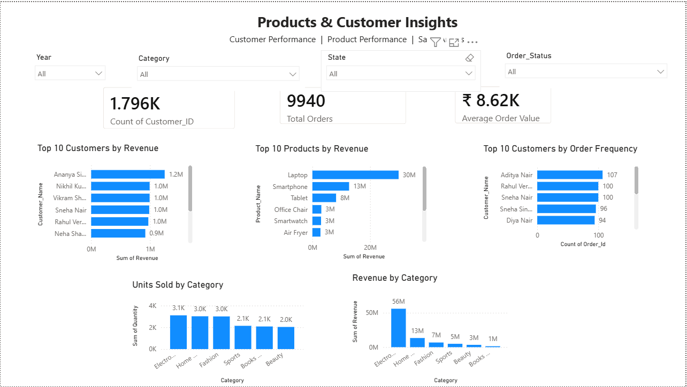
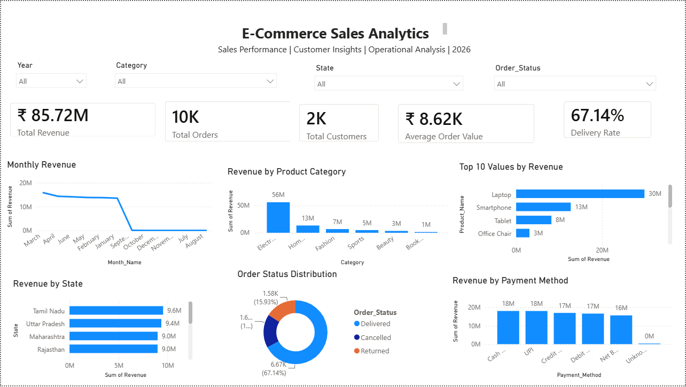

# E-Commerce Sales Analytics Dashboard

## 📊 Project Overview

This project presents an end-to-end **E-Commerce Sales Analytics** solution using **Python, MySQL, and Power BI**.

The project transforms raw and inconsistent e-commerce transaction data into a cleaned analytical dataset, performs business analysis using SQL, and presents key insights through an interactive Power BI dashboard.

---

## 🎯 Business Objectives

The main objectives of this project are:

- Analyze overall sales and revenue performance
- Identify top-performing product categories and products
- Analyze customer purchasing behavior
- Identify high-value customers
- Compare regional sales performance
- Analyze order status and delivery performance
- Understand payment method usage
- Analyze the impact of discount levels
- Track monthly sales trends
- Build an interactive business dashboard

---

## 🛠️ Tools & Technologies

| Tool | Purpose |
|---|---|
| Python | Data cleaning and preprocessing |
| Pandas | Data manipulation and transformation |
| MySQL | Data storage and SQL analysis |
| SQL | Business analysis and aggregations |
| Power BI | Interactive dashboard |
| DAX | KPI calculations and measures |
| Jupyter Notebook | Data cleaning workflow |

---

## 🔄 Project Workflow

```text
Raw E-Commerce Data
        ↓
Data Cleaning & Validation
        ↓
Python / Pandas
        ↓
Cleaned Dataset
        ↓
MySQL Database
        ↓
SQL Business Analysis
        ↓
Power BI
        ↓
Interactive Dashboard
        ↓
Business Insights & Recommendations
'''


## 🧹 Data Cleaning

The raw e-commerce dataset contained duplicate records, missing values, inconsistent dates, and data-quality issues.

The cleaning process included:

- Removing duplicate records
- Handling missing values
- Standardizing dates
- Validating numerical fields
- Creating date-related features
- Creating Age_Group
- Performing final data-quality checks

## 📊 Dataset Summary

- Rows: 9,940
- Columns: 23
- Duplicate rows: 0
- Missing values: 0
- Unique Customers: 1,796

## 📈 Key KPIs

| KPI | Value |
|---|---:|
| Total Revenue | ₹85.72M |
| Total Orders | 9,940 |
| Total Customers | 1,796 |
| Average Order Value | ~₹8.62K |
| Delivery Rate | 67.14% |

## 🏆 Key Business Insights

- Electronics is the highest-revenue category with ₹55.98M.
- Laptop is the top individual product with ₹29.89M revenue.
- Tamil Nadu is the highest-revenue state with ₹9.55M.
- Delivered orders account for the majority of orders.
- UPI and Cash on Delivery are major payment methods.
- Revenue is highest at the 0% discount level.

## 📊 Power BI Dashboard

The dashboard provides interactive analysis of:

- Sales performance
- Product performance
- Customer insights
- Regional performance
- Order status
- Payment methods
- Discount analysis
- Monthly revenue trends

## 📸 Dashboard Screenshots

### Executive Dashboard



### Product & Customer Dashboard



## 📂 Repository Structure

```text
## 📂 Repository Structure

```text
E-Commerce-Sales-Analytics/
│
├── data/
│   └── ecommerce_sales_cleaned.csv
│
├── documentation/
│   └── Ecommerce Sales Analytics Document.docx
│
├── powerbi/
│   └── ecommerce_sales_dashboard.pbix
│
├── python/
│   └── data_cleaning.ipynb
│
├── screenshots/
│   ├── Executive_Dashboard.png
│   └── Customer_Product_Dashboard.png
│
└── sql/
    └── ecommerce_sales_analysis.sql

## 💡 Business Recommendations

- Focus inventory and marketing on high-performing products.
- Develop loyalty strategies for high-value customers.
- Investigate cancelled and returned orders.
- Use targeted rather than broad discounting.
- Optimize popular payment methods such as UPI and Cash on Delivery.

## 👨‍💻 Skills Demonstrated

- Python
- Pandas
- SQL
- MySQL
- Power BI
- DAX
- Data Cleaning
- Data Visualization
- Business Intelligence
- Dashboard Development
- KPI Development
- Business Analysis

## 📌 Conclusion

This project demonstrates an end-to-end Data Analyst workflow, from raw data cleaning and SQL analysis to Power BI visualization and business recommendations.

The final dashboard provides an interactive view of sales, products, customers, regions, orders, payment methods, and discounts to support data-driven business decisions.
